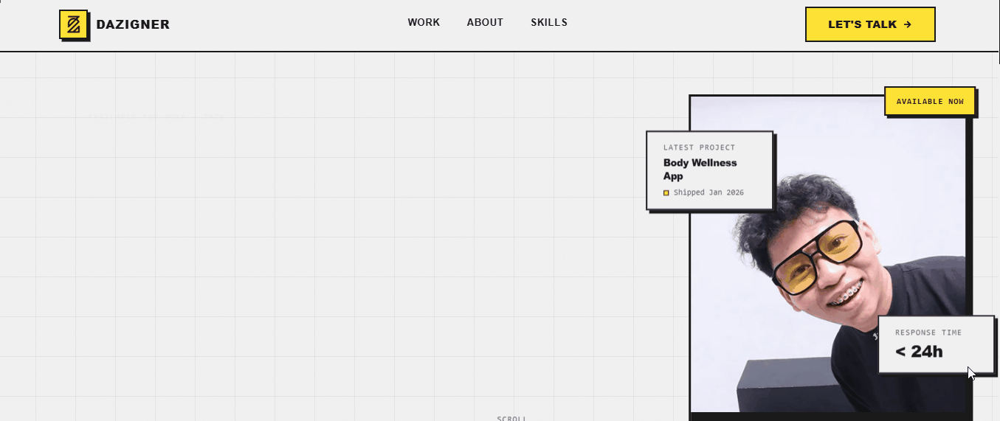

# ⚡ Dazigner

### Neo-Brutalist Developer Portfolio

A modern **neo-brutalist portfolio website** built with **Next.js and React** to showcase my projects, design work, and development experiments.

---

---
# 🌐 About The Project

**Dazigner** is my personal portfolio website designed with a **neo-brutalist visual style** — bold colors, sharp contrasts, and playful layouts.

The project showcases my work as a:

- 💻 Full-stack developer  
- 🎨 UI/UX designer  
- 🖌 Graphic designer  

This portfolio was **automatically generated using Rocket.new**, an AI-powered platform that builds websites from prompts.

---

# 🎨 Design Style

The website uses a **Neo-Brutalist design approach** characterized by:

- bold colors
- strong typography
- visible layout structure
- playful UI components
- minimal polish but high personality

Neo-brutalism embraces **raw digital aesthetics** while remaining modern and interactive.

---

# ✨ Features

⚡ Built with **Next.js + React**  
🎨 Neo-Brutalist UI design  
📱 Fully responsive layout  
🧑‍💻 Projects showcase  
📄 About / profile section  
📬 Contact section  
🚀 Fast performance with Next.js  

---

# 🧰 Tech Stack

| Technology | Purpose |
|------------|--------|
| Next.js | React framework |
| React | UI library |
| CSS / Tailwind | Styling |
| Rocket.new | AI website generator |

---

# 👨‍💻 Author

**Shahdaz Azmi**

Developer • Designer • Creator

GitHub  
https://github.com/shdzazmi

---

# ⭐ Support

If you like this project, consider giving it a ⭐ on GitHub!

---

⚡ Built with creativity, AI, and neo-brutalist vibes

